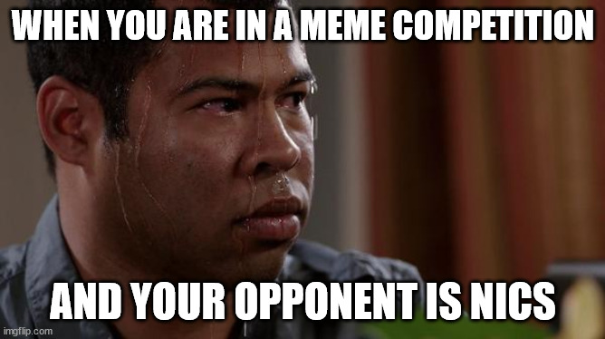
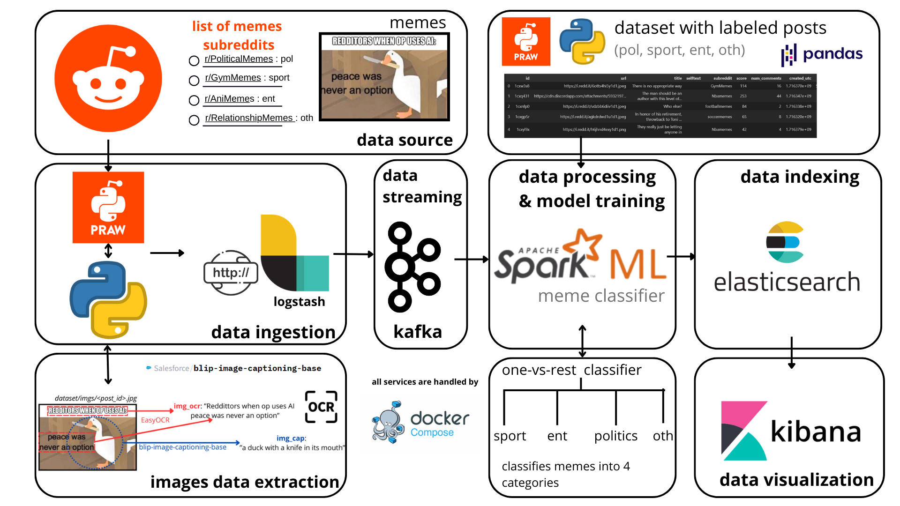

# hypermeme

=======
*inspired by [NicsMeme](https://github.com/search?q=repo%3Atapunict%2Ftap2024%20nicsmeme&type=code)®*

> "In the future memes will be able to generate themselves and propagate automatically"  

*see also the [Dead Internet Theory](https://en.wikipedia.org/wiki/Dead_Internet_theory)*



---

## For a complete presentation of this project see [hypermeme.ipynb](hypermeme.ipynb)  

## Project overview

### Brief description

The aim of this project is to categorize memes into 4 categories or topics.  

- pol: politics
- ent: entertainment
- sport: sports
- oth: other  

 The classification is based on their visual content (ocr and caption).

### Project structure



## Setup

0. Make sure you got docker and wget installed  on your machine as they are required for this project
1. Download Kafka

    ```shell
    cd ./kafka/setup
    wget https://downloads.apache.org/kafka/3.7.1/kafka_2.13-3.7.1.tgz 
    ```

2. Build containers

    ```shell
    # if you want gpu acceleration
    docker compose -f gpu_compose.yaml build
    # otherwise (cpu)
    docker compose build
    ```

4. Start pipeline (see quickstart)
5. Import `dashboard+data_view.ndjson` file from /kibana directory into kibana

## Quickstart

```shell
    # if you want gpu acceleration
    docker compose -f gpu_compose.yaml --profile pipeline up
    # otherwise (cpu)
    docker compose --profile pipeline up
```

## Download the dataset

```shell
    docker compose --profile download_dataset up
```

## Model training

```shell
    # Pretrained model is already included with this repo. If you want to rebuild it using your own data you can use this command
    docker compose --profile build_model up
```

## Useful links

| Container  | URL |Description|
| ------------- | ------------- | ------- |
|  kafka-UI  |  <http://localhost:8080>  |    Open kafka UI |
| kibana  | <http://localhost:5601>  |    Kibana base URL |

## Dashboard demo


## Technologies Used

- **Ingestion**:
  - Python Script: download memes from selected subreddits using Python Reddit API Wrapper [PRAW](https://praw.readthedocs.io/en/stable/ "PRAW")
  - [Logstash](https://www.elastic.co/logstash
    "Logstash")
- **Image data extraction**
  - Image captioning model: [blip-image-captioning-large su huggingface](https://huggingface.co/Salesforce/blip-image-captioning-large)  
  - [EasyOcr](https://www.jaided.ai/easyocr/tutorial/)
- **Streaming**:
  - [Apache Kafka](https://www.confluent.io/what-is-apache-kafka "Apache Kafka")
- **Processing**:
  - [Spark Streaming](https://spark.apache.org/streaming/ "Spark Streaming")
  - [Spark MLlib](https://spark.apache.org/mllib/ "Spark MLlib")
- **Indexing**:
  - [ElasticSearch](https://www.elastic.co/what-is/elasticsearch "ElasticSearch")
- **Visualization**:
  - [Kibana](https://www.elastic.co/what-is/kibana "Kibana")
