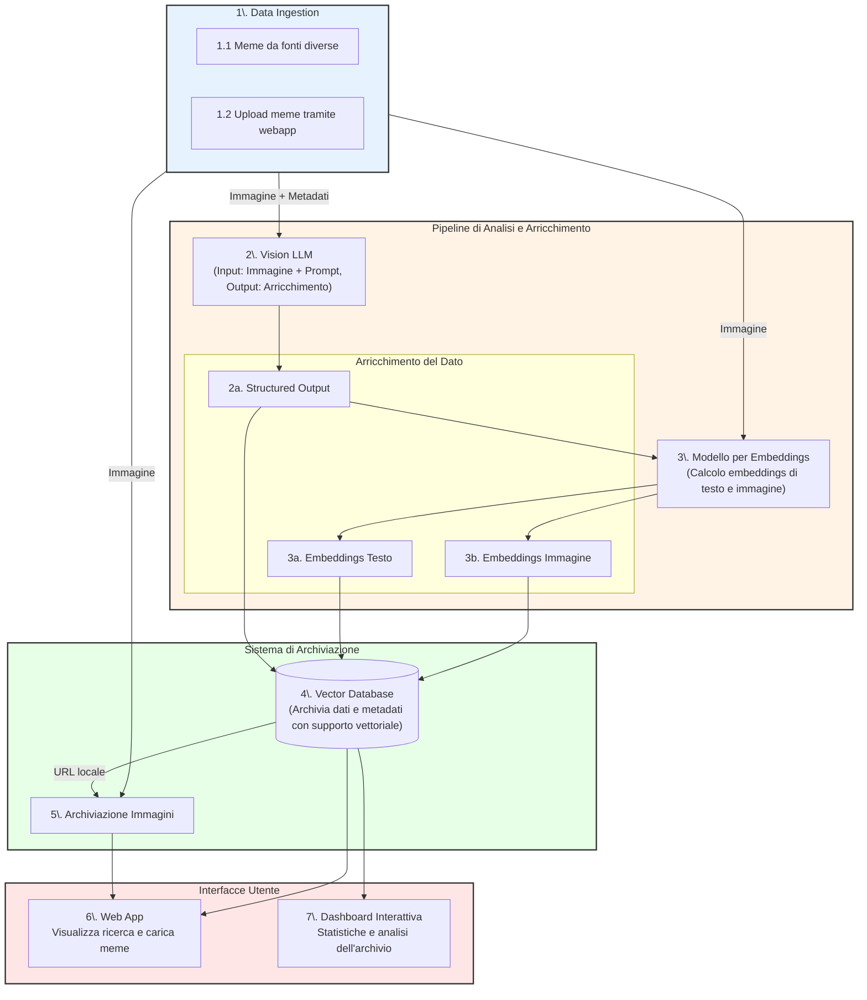

# MEMES - Memes Enrichment Management Exploration System

Sistema per l’analisi e l’archiviazione di meme di internet

## Introduzione

MEMES è un sistema modulare pensato per analizzare, arricchire e archiviare meme provenienti da diverse fonti online. Integrando strumenti di ingestion, modelli di linguaggio e visione, e tecnologie di embedding, il progetto mira a facilitare ricerche semantiche avanzate sui meme.  
MEMES (Memes Enrichment Management Exploration System) offre una soluzione completa e scalabile per l'analisi e l'archiviazione dei meme, combinando tecnologie di elaborazione del linguaggio naturale, visione artificiale e archiviazione vettoriale per abilitare ricerche semantiche avanzate.

## Caratteristiche principali

- Arricchimento dei meme tramite modelli LLM e sistemi di vision.
- Calcolo di embedding per testi e immagini.
- Indicizzazione dei dati e dei metadati in Elasticsearch.
- Integrazione con sistemi di ingestion per il recupero automatizzato dei meme.
- Interfaccia web per la ricerca semantica, testuale o per immagine e la visualizzazione dei meme indicizzati.

## Struttura del Sistema

Il sistema è organizzato in diverse fasi:

1. **Scraping dei Meme:** Recupero dei meme da fonti online.
2. **Download delle Immagini:** Salvataggio locale delle immagini e dei template.
3. **Arricchimento:** Elaborazione delle immagini tramite modelli LLM e visivi per generare descrizioni e embedding.
4. **Indicizzazione:** Salvataggio dei dati e dei vettori in Elasticsearch per abilitare ricerche semantiche.
5. **Interfaccia Utente:** Web app per effettuare ricerche sia per keyword sia in base alla somiglianza degli embedding.

---
## Architettura Generale

```mermaid
flowchart TB
    %% Subgraph 5: Data Ingestion
    subgraph Ingestion ["1\. Data Ingestion"]
        A["1.1 Meme da fonti diverse"]
        B["1.2 Upload meme tramite webapp"]
    end

    %% Subgraph 1 & 2: Pipeline di Analisi e Arricchimento
    subgraph MainPipeline ["Pipeline di Analisi e Arricchimento"]
        C["2\. Vision LLM<br>(Input: Immagine + Prompt, Output: Arricchimento)"]
        D["3\. Modello per Embeddings<br>(Calcolo embeddings di testo e immagine)"]
        
        subgraph Enrichment ["Arricchimento del Dato"]
            E["2a. Structured Output"]
            F["3a. Embeddings Testo"]
            G["3b. Embeddings Immagine"]
        end
    end


    %% Subgraph 3 & 4: Archiviazione
    subgraph Storage ["Sistema di Archiviazione"]
        H[("4\. Vector Database<br>(Archivia dati e metadati con supporto vettoriale)")]
        I["5\. Archiviazione Immagini"]
    end

    %% Subgraph 6 & 7: Interfacce Utente
    subgraph Frontend ["Interfacce Utente"]
        K["6\. Web App<br>Visualizza ricerca e carica meme"]
        L["7\. Dashboard Interattiva<br>Statistiche e analisi dell'archivio"]
    end

    %% Connessioni tra i nodi
    Ingestion -- "Immagine + Metadati" --> C
    Ingestion -- "Immagine" --> I
    Ingestion -- "Immagine" --> D

    C --> E
    E --> D
    D --> F & G

    E --> H
    F --> H
    G --> H

    H -- "URL locale" --> I

    I --> K
    H --> K
    H --> L

    %% Stili
    style Ingestion fill:#e6f3ff,stroke:#333,stroke-width:2px
    style MainPipeline fill:#fff3e6,stroke:#333,stroke-width:2px
    style Storage fill:#e6ffe6,stroke:#333,stroke-width:2px
    style Frontend fill:#ffe6e6,stroke:#333,stroke-width:2px
```
